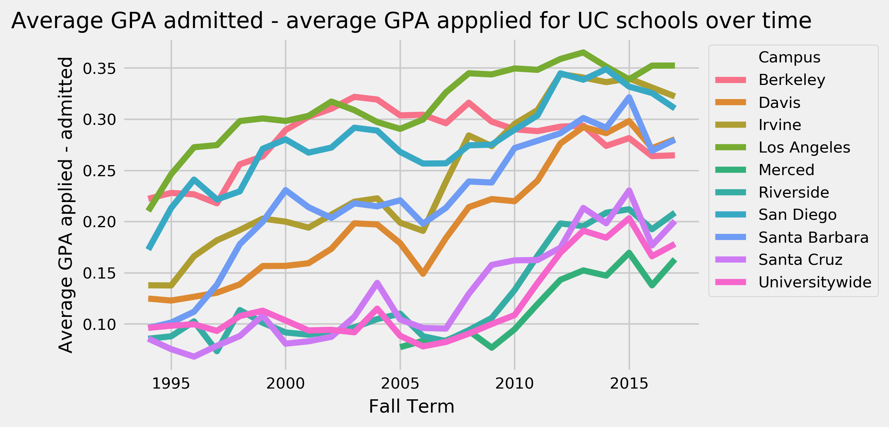

# An Analysis of Sociocultural and Temporal Trends in UC Admissions Data

## Authors

Aurum Kathuria, Manan Khattar, Chudi Nnorukam, Melissa Wong, Alice Wu. Repo available at https://github.com/mk1123/calAdmissions. 

## Motivation

As freshmen and sophomores currently enrolled in the University of California, Berkeley, all five of us have fresh memories of the trials and tribulations associated with the college admissions process. Once we found out that the UC Infocenter had released comprehensive admissions data for freshmen and transfer students to the UC System going back over twenty years, we decided to explore this dataset for ourselves, wanting to both satisfy our own curiosity about the factors that may have affected our admission to UC Berkeley and also pull out interesting/surprising trends in the data that could be useful for high schoolers like our former selves in understanding exactly where they stand in the admissions process.

## Methodology 

We used the UC admissions (freshmen, transfer, and GPA) datasets available [here](https://www.universityofcalifornia.edu/infocenter/admissions-source-school), California County Wealth Data available [here](https://datausa.io/profile/geo/california/#economy), and California County population data available [here](http://worldpopulationreview.com/us-counties/ca/) as our source data. We conducted all our analysis using Numpy, Pandas, and Matplotlib on Jupyter Notebooks. 

## Data Analysis

We began by exploring demographic and economic trends in the admissions data, with a particular emphasis on California counties.

### County admissions analysis

##### County admissions vs. Capita

Here are the top-10 California counties ordered by number of total freshmen admissions:


And the top-10 California counties ordered by number of total transfer admissions:


With slight variation, the number of admissions per county roughly followed the population of each county:


Notably, San Bernardino County and Riverside County are both top-5 in 2018 population but do not fall in the top-5 for both freshmen and transfer admissions, while contrastingly Santa Clara and Alameda County are not top-5 in population but are top-5 in admissions for both freshmen and transfer students. This motivates us to construct a graph of admissions per county capita, for the top-10 counties in terms of total admissions:  


This proves our observation that Alameda County and Santa Clara County "overachieved" in terms of their capita, while Riverside and San Bernardino “underachieved”, compared to the other counties. But why was this case? A strong correlating factor could be average household wealth in the county. 


#### County admissions vs. Wealth


To explore this further, we plotted the relationship between admitted, enrolled, and applied statistics for each county, vs. the average household wealth of the county. Specifically, we first graphed the raw sum for the admitted, enrolled, and applied statistics for each county. Then, we considered 3 other subparameters: the percentage of students admitted who applied, the percentage of students enrolled who admitted, and the percentage of students enrolled who applied. 


Interestingly, as the median household income of the county increases, the raw number of students that apply seems to increase dramatically, while the number of students who are admitted and the number of students that are enrolled seems to stay relatively constant. This implies that the values for each of our subparameters—admitted/applied, enrolled/applied, enrolled/admitted—should decrease as the wealth of the county increases, and indeed this is the case:


While correlation does not imply causation, we can hypothesize a reason for this relationship: while students from relatively poorer counties get less opportunities and academic support in general, leading to fewer applications per capita, many of the students that do apply have a distinguishing “grit” or sense of determination that shines through their applications. 


### Time-based analysis

After considering admissions data by county, we analyzed and observed changes in application rates and enrollments over time. This is a crucial component in understanding historical and demographic patterns in admissions, and in some ways is the most informative to students currently in the admissions process, because it gives them a sense of where they stand in terms of demographics and GPA at this moment in time (2018).

##### Ethnicity vs. Admissions

We now move to a discussion of a recently controversial topic, race/ethnicity in admissions. In recent times, there has been much debate about whether college admisisons are unbiased ethnically—a lawsuit claiming that Asian-American students were victims of [illegal discrimination](https://www.newyorker.com/magazine/2018/10/15/the-rise-and-fall-of-affirmative-action) in Harvard College gained much scrutiny and media attention, and went to trial in October 2018. We explored this topic using our dataset, which gave us admissions data split by 6-categories of ethnicity—African American, Asian, Hispanic/Latino, White, American Indian, and International. 

To get a general look at the issue of ethnicity in admissions, we first decided to plot a graph of Admission Rate to all UCs by Ethnicity, over the past 20 years:


Apart from the American Indian and International graphs, which perhaps suffer due to not as large a sample size, the plots for the rest of the ethnicities look fairly similar in terms of trend. The admissions rate for White, Asian, and Hispanic/Latino students was as high as 70% around 1995, which is somewhat surprising given how competitive admissions throughout the UC system currently are. Other notables in the graph include a UC-wide dip in admissions rate in 2004, which was part of a “UC-wide reduction in freshman enrollment mandated by the governor due to California's budget situation” (https://news.ucsc.edu/2004/04/485.html). Since then, admissions numbers have decreased fairly steadily, to their current 20%-50% range. 


We also plotted admission rate for UC Berkeley over time, to see if there was any significant difference between the graphs for Berkeley and UC Campuswide:


Apart from the lack of dip in admissions in the year 2004, there does not seem to be a significant difference between the Berkeley data and the University-wide data. The plotlines that have less data to support them (African American, American Indian, International) are predictably more unstable than the plotlines for Asians and Whites, which have a much higher number of applicants.


We also plotted yield rate of different ethnicities over time (where yield rate is the number of students who enroll / number of students who are admitted) to see if there any racial component to the students choosing to not attend the UC system despite getting in. Here is the graph:


As shown, there does not seem to be much of a trend in yield from year to year, and there are large fluctuatins on a yearly basis for each race. The Asian yield is very similar to the total overall yield, which is clearly a result of of the majority of admits being Asian.


Finally, given that we are Berkeley students, we wanted to devote our attention to specifically raw counts for admitted students over time, separated by ethnicity:


It is interesting to see that in the year 2012, there was a severe dip in the number of white students admitted to UC Berkeley—a decrease of 469 students, or roughly 12% of the number of white students admitted in 2011. In addition, the number of white students decreased from its peak at around 2400 students in 2009 to as low as 1500 students in 2012, a 60% decrease. This decrease was not reported as part of any specific strategy that UC admissions made public, so it could be that this is part of an internal strategy by UC admissions to diversify their student body. It could also be random change, but its an interesting development in any case.

​	

##### Average GPA by Campus

After considering ethnicity data, we decided to examine GPA data as it varies across different UC campuses over time. High school GPA is inherently noisy, because it highly depends on the rigor of the high school, but nevertheless we were able to fit fairly regular lineplots for each of students applying, getting admitted, and enrolling for each of the 9 campuses:


One interesting thing to note about is that UC Berkeley has the the highest average GPA of students applying in 2017 by a fair amount, but it is actually UCLA that has the highest average GPA of students enrolled in 2017. One can imagine that the trend of a school to take higher GPA students of those who apply (modeled as `average_GPA_admitted - average_GPA_applied`) is someting that would be useful to know for prospective applicants, so we created a visualization modeling this:




As predicted, UCLA has the highest value for `average_GPA_admitted - average_GPA_applied`, while UC Merced has the lowest. UC Berkeley sits right in the middle. For students thinking about applying to UCLA, it seems that keeping their GPAs high is more important for them than it would be for students targeting other UCs.


### Impact of the *Ortiz*-*Pacheco*-*Poochigian*-*Vasconcellos Cal Grant Act*


In the year 2000, the *Ortiz*-*Pacheco*-*Poochigian*-*Vasconcellos Cal Grant Act* passed in the California Senate. Here’s a description of the grant: 

> On September 11, Gov. Gray Davis approved a new Cal Grant law that commits at least $1.2 billion in grant money to meritorious students with limited financial means who enroll in public or private institutions of higher education in California. The bipartisan measure, co-authored by Senators Deborah Ortiz and Charles Poochigian, establishes the Ortiz-Pacheco-Poochigian Vasconcellos Cal Grant Program.
>
> The law underscores the state's commitment to higher education and helps fulfill the promise of the 1960 California Higher Education Master Plan to provide access to higher education for academically qualified students.

This Grant is the largest public grant that the UC system has received in over half a century. Given that such a large amount of money was injected into the UC financial aid funds, we were interested in seeing if this grant actually had a tangible impact on the ability of low-income students to attend college. 

We decided to model the problem in terms of the model that we created before: Average Household Income vs. the three subparameters that we considered before (admitted to applied, enrolled to admitted, and enrolled to admitted): 


After that, we plotted the admissions data for the year 1999 and 2001 (before and after the Grant) and correlated it with average household income in the county at that time: 


```python
Regression Equations For: admitted to applied
Linear Regression Equation: -3.57x + 60.98 
r^2: 0.2834 p-value: 0.001
Regression Equations For: enrolled to applied
Linear Regression Equation: -2.76x + 40.46 
r^2: 0.2295 p-value: 0.0036
Regression Equations For: enrolled to admitted
Linear Regression Equation: -1.38x + 68.43 
r^2: 0.0223 p-value: 0.3919
```


```python
Regression Equations For: admitted to applied
Linear Regression Equation: -1.97x + 45.71 
r^2: 0.1288 p-value: 0.0316
Regression Equations For: enrolled to applied
Linear Regression Equation: -1.79x + 30.9 
r^2: 0.1438 p-value: 0.0226
Regression Equations For: enrolled to admitted
Linear Regression Equation: -1.87x + 70.35 
r^2: 0.0483 p-value: 0.198
```


Just from the eye test, the slopes across the graphs seem to be significantly differing slopes, especially the `admitted to applied` lineplot:


 However, we wanted to show this quantifiably. Therefore, having regression lines for the 1999 data and the 2001 data, we created a bootstrap on the 1999 regression data (with 10000 resamples) and got the following 90% confidence interval for the slope and intercept for the `admitted to applied` line:

```python
5th percentile slope: -4.950037003458924, 95th percentile slope:  -2.200788273711553,
5th percentile intercept: 50.856512445888484, 95th percentile intercept: 70.49255558690935
```

Our regression for the 2001 `admitted to applied` data is `-1.97x + 45.71`, so both the slope and the intercept are outside the 90% confidence interval. Therefore, we can say with 90% confidence that the models for the 1999 data and the 2001 data are different, and the passing of the *Ortiz*-*Pacheco*-*Poochigian*-*Vasconcellos Cal Grant Act* correlates with a significant change in admissions rate as compared to Household income. One possibility is that lower income students were more confident in their ability to receive financial aid after the Grant, so they applied in higher numbers, affecting the distribution.


### What is Berkeley like today?

After having examined the impact county, ethnicity, GPA, and economic standing on UC admissions, we wanted to conclude our analysis with a couple of simple graphs showcasing the distribution of the most recent group of freshmen and transfers entering the UC Berkeley student body:


It’s striking how large a proportion Asian students occupy of the UC Berkeley Class of 2021. Minority groups, including Hispanic/Latino, African American, American Indian, and International students, occupy less than 20% of the population group. Transfer students, however, have a much more balanced population distribution, featuring significant and comparable amounts of Asian, Hispanic/Latino, International, and White students. We reserve no judgments for whether this is a positive or negative development; it’s just something to consider and keep in mind when thinking about the decisions the ASUC makes and UC Berkeley’s identity in general. 

## Conclusion


This project was an exploratory look at UC admissions data over the twenty years, trying to consider several different parameters—county population, county income, ethnicity in terms of admission rate and yield rate over time, GPA trends over time, the impact of the 2000 Cal Grant Act on admission rates—and their impacts on admissions trends through the form of visualizations. We hope that our analysis was insightful and prompted some thought on the current college admissions process!
